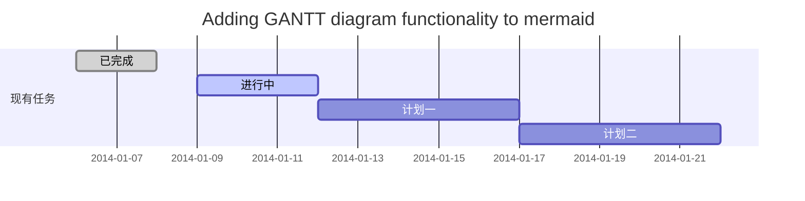
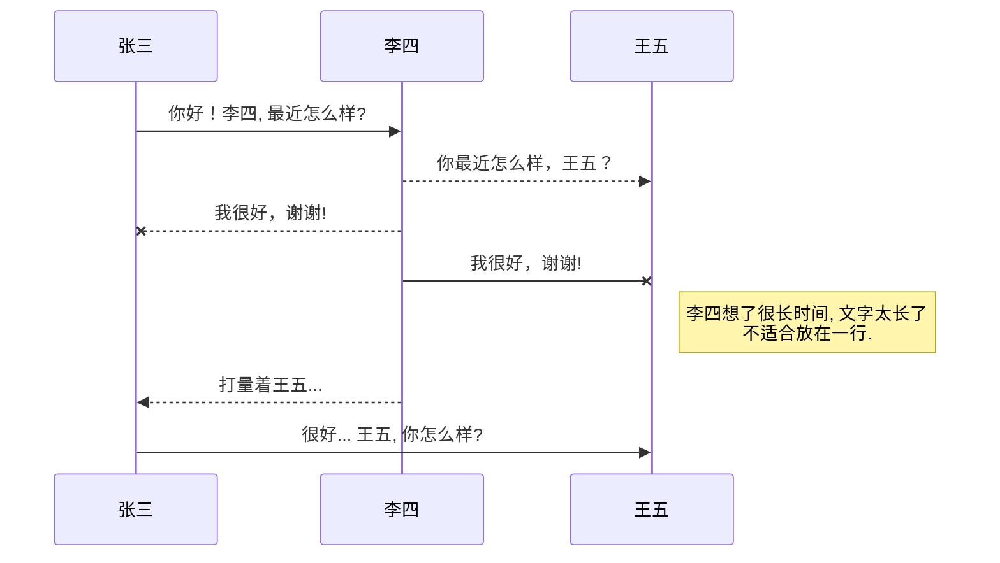
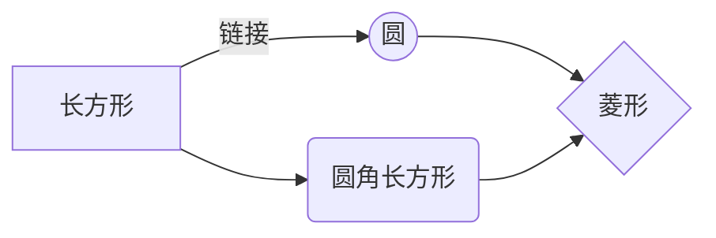

# 一级标题  
## 二级标题  
### 三级标题  
#### 四级标题  
##### 五级标题  
###### 六级标题  

## 字体格式强调  
*强调*  (示例：斜体)  
 _强调_  (示例：斜体)  
**加重强调**  (示例：粗体)  
 __加重强调__ (示例：粗体)  
***特别强调*** (示例：粗斜体)  
___特别强调___  (示例：粗斜体)  

## 代码块  
`<hello world>`

## 代码块高亮  
```
@Override  
protected void onDestroy() {  
    EventBus.getDefault().unregister(this);  
    super.onDestroy();  
}  
```  
## 表格 （建议在表格前空一行，否则可能影响表格无法显示） 
 
 表头  | 表头  | 表头
 ---- | ----- | ------  
 单元格内容  | 单元格内容 | 单元格内容 
 单元格内容  | 单元格内容 | 单元格内容  

## 其他引用  
### 图片  
  
### 链接  
[链接名称](https://www.baidu.com/)

## 列表 
1. 项目1  
2. 项目2  
3. 项目3  
   * 项目1 （一个*号会显示为一个黑点，注意⚠️有空格，否则直接显示为*项目1） 
   * 项目2

## 换行（建议直接在前一行后面补两个空格）
直接回车不能换行，  
可以在上一行文本后面补两个空格，  
这样下一行的文本就换行了。
或者就是在两行文本直接加一个空行。
也能实现换行效果，不过这个行间距有点大。

## 引用
> 第一行引用文字  
> 第二行引用文字

## 标记文本
==左右各两个等号==
## 删除文本
~~左右各两个波浪符~~

- [ ] 计划任务 
- [x] 完成任务

## 新的甘特图功能，丰富你的文章


- 关于 **甘特图** 语法，参考 [这儿][2],

## UML 图表

可以使用UML图表进行渲染。 [Mermaid](https://mermaidjs.github.io/). 例如下面产生的一个序列图：



这将产生一个流程图。:



- 关于 **Mermaid** 语法，参考 [这儿][3],

## FLowchart流程图

我们依旧会支持flowchart的流程图：
```mermaid
flowchat
st=>start: 开始
e=>end: 结束
op=>operation: 我的操作
cond=>condition: 确认？

st->op->cond
cond(yes)->e
cond(no)->op
```